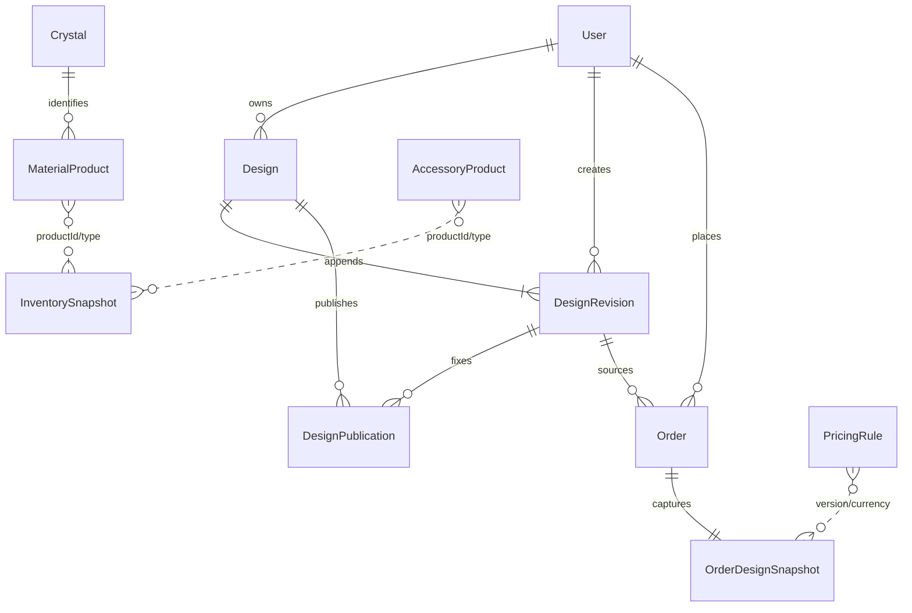

# Persistence Model V1

Date: 2026-07-21  
Schema baseline: `20260721140000_init_mystcrag_persistence_v1`

## Entity relationships

`InventorySnapshot` uses an intentional `(productType, productId)` polymorphic reference because it captures inputs from multiple catalog tables. Repository validation supplies referential checks.

## Models and fields

| Model | Purpose and principal fields |
| --- | --- |
| `User` | Identity: `id`, optional unique `email`, `displayName`, timestamps. |
| `Design` | Editable aggregate: `id`, `ownerId`, `name`, `mode`, `status`, `schemaVersion`, `currentRevision`, `locale`, `currency`, `currentSnapshot`, compliance/community projection fields, timestamps, `deletedAt`. |
| `DesignRevision` | Immutable history: `designId`, positive `revisionNumber`, `schemaVersion`, `snapshot`, `changeType`, `changeReason`, `createdBy`, `createdAt`. |
| `DesignPublication` | Fixed-revision authorization: design/revision/actor IDs, non-private `visibility`, required consent, remix/display controls, status and publish/unpublish timestamps. |
| `Order` | Transaction header: user, status, currency, `totalAmountMinor`, revision, timestamps. |
| `OrderDesignSnapshot` | Immutable one-to-one order evidence: design/pricing/production/fulfillment JSON, currency, schema and pricing-rule versions, captured timestamp. Fulfillment records requested, reserved, and backorder quantities. |
| `Crystal` | Non-sellable knowledge record with mineral, visual/cultural, availability, and compliance reference data. |
| `MaterialProduct` | Sellable bead: crystal, SKU, name, shape/diameter, material/model/texture keys, currency, price/cost minor units, active flag, timestamps. |
| `AccessoryProduct` | Sellable accessory: SKU, type/material/finish/dimensions, model/texture keys, currency, price/cost minor units, active flag, timestamps. |
| `InventorySnapshot` | Append-only availability observation: product type/ID, available/reserved quantity, capture time and source version. |
| `PricingRule` | Versioned currency-specific rule JSON and active flag. |
| `DesignTemplate` | Existing design-DNA authoring data; it is not transaction history. |

## Indexes and uniqueness

- `DesignRevision`: unique `(designId, revisionNumber)`; actor/time index.
- `Design`: owner/update and status/deletion indexes.
- `DesignPublication`: status/publish-time and design/status indexes.
- `Order`: user/time and revision indexes; `OrderDesignSnapshot.orderId` is unique.
- Product SKU is unique; products are indexed by currency/active, and materials by crystal/active.
- `InventorySnapshot`: unique `(productType, productId, sourceVersion)` plus latest-capture lookup index.
- `PricingRule`: unique `(version, currency)` plus active currency lookup.

## Deletion and immutability

All foreign keys explicitly use `RESTRICT`. A user or design cannot be removed while lifecycle evidence references it. `Design` uses `deletedAt`; `DesignRevision` cannot be updated/deleted; `Order` cannot be deleted; `OrderDesignSnapshot` cannot be updated/deleted; `DesignPublication` becomes `UNPUBLISHED`; referenced products become `active=false`. Database triggers enforce revision and order-snapshot immutability in addition to repository APIs.

## Money rules

PostgreSQL stores `unitPriceMinor`, `unitCostMinor`, and `totalAmountMinor` as checked, non-negative `BIGINT`. CNY is fen; TWD is whole-dollar minor units. Each currency has an independent catalog and pricing version; there is no exchange-rate path. Repositories reject fractional/negative/unsafe input before `number -> bigint` conversion and reject out-of-safe-range data before `bigint -> number` conversion. Prisma `bigint` is never serialized to an API.

## JSON snapshot rules

`Design.currentSnapshot` and `DesignRevision.snapshot` store complete `DesignV1`. `OrderDesignSnapshot` separately stores the complete priced design plus its `PricingV1`, `ProductionV1`, and `OrderFulfillmentSnapshotV1` children so transaction evidence is directly auditable. A Tarot shortage sets the order to `AWAITING_RESTOCK` and uses a five-day advisory; other design modes remain inventory-blocking. Every write and read uses the corresponding Zod schema. The structured `schemaVersion` must agree with the snapshot. Unknown major versions are rejected; supported old versions must pass an explicit Design Contract migration before storage. Prisma `JsonValue` does not leave repositories.

## Revision lifecycle

1. Creation accepts an actor-owned, validated revision-1 snapshot.
2. One transaction inserts `Design` and revision 1.
3. Update accepts `expectedRevision`, validates a snapshot at `expectedRevision + 1`, conditionally updates the non-deleted owner row, and appends one revision.
4. A zero-row conditional update returns `CONFLICT` for a stale revision or `NOT_FOUND` for missing/deleted/unowned data.
5. Restore and AI optimization create new revisions; they never overwrite history.

## Publication lifecycle

Publication validates that the requested revision belongs to the actor-owned design, consent is true, visibility is not private, and compliance is PASSED without required review. It stores the exact revision ID. Later current-design changes cannot affect the public result. The community projection removes production notes and commercial data. Unpublishing retains the row and revision while setting status and `unpublishedAt`.

## Order snapshot lifecycle

Order creation loads the requested immutable revision, blocks rejected or review-required flagged designs, reloads active currency-matched catalog prices, selects the active pricing rule, recomputes the total, compares expected price/version, and validates the latest inventory snapshots. Only then does one transaction create the order and its immutable snapshot. Later design, product-price, inventory, or pricing-rule changes do not alter the captured order. No complex reservation or production scheduling is introduced in V1.
